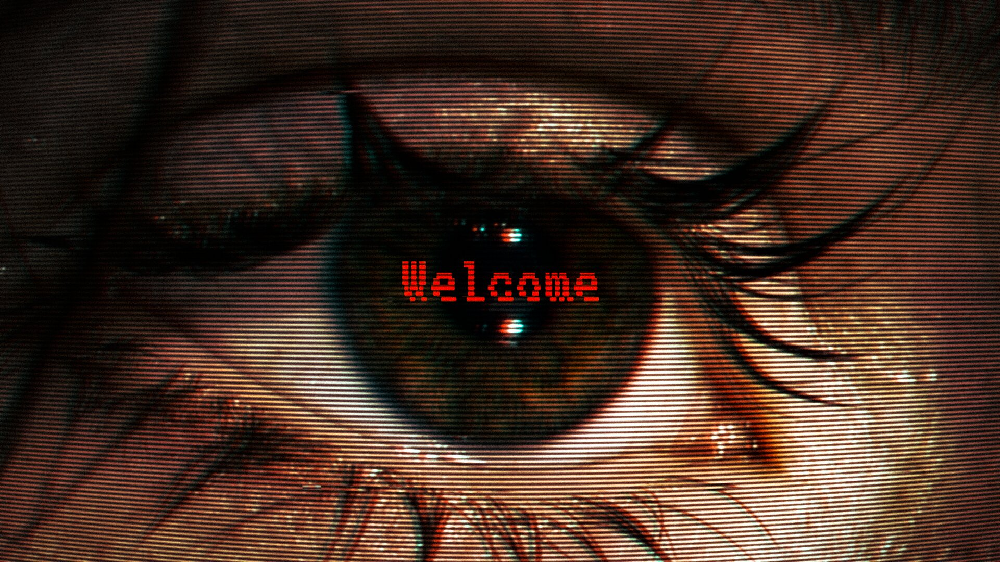

# Haaland Optic

Portfolio site. Plain HTML, CSS and JavaScript. No build step, no npm, no framework.

---

## Open it

1. Download and unzip somewhere sensible, e.g. `Documents/haaland-optic`.
2. In VS Code: **File → Open Folder** → pick that folder.
3. Install the **Live Server** extension (VS Code will suggest it for you).
4. Right-click `index.html` → **Open with Live Server**.

Live Server reloads the page every time you save. Opening `index.html` by
double-clicking also works, but Live Server is nicer.

---

## The four files that matter

| file | what's in it |
|---|---|
| `js/content.js` | **Projects.** Add, remove, reorder. This is the file you'll live in. |
| `index.html` | **All the words.** Headline, about, capabilities, contact, ticker. |
| `css/style.css` | **Colour and type.** The three colours are at the very top. |
| `img/` | Your images. `hero.jpg` plus a `work/` folder. |

`js/site.js` is the engine. You shouldn't need to open it.

---

## Add a project

Open `js/content.js`, copy the commented block at the bottom of the list:

```js
{
  title:  'New project',
  kind:   'Brand identity',
  note:   'One or two sentences.',
  code:   'NEW',
  images: ['img/work/new-01.jpg'],
  link:   ''
}
```

Save. Refresh. The wall repacks itself around however many projects you have,
and the index list updates too. Nothing else to touch.

**`images: []`** means a poster gets generated for that project, in the site's
palette. Useful while you're waiting on real photography.

**`link`** adds a "View project ↗" button in the detail panel. Leave it `''` to hide it.

---

## Swap the hero image

Put your file in `img/`, then change one line in `index.html`:

```html

```

16:9 works best. **No filter is applied to it** — what you export is exactly
what shows. The dark wash at the bottom stays, because the headline has to be
readable over it.

If you ever want the wine duotone back, change the line above it to:

```html
<div class="hero-plate tinted">
```

---

## Change the colours

Top of `css/style.css`:

```css
--ink:   #0A0A0B;   /* ground */
--paper: #EDEBE7;   /* type */
--wine:  #A8202F;   /* the accent */
```

Change those three and the whole site follows, generated posters included.
Every grey on the site is `--paper` at low opacity, so it can't drift out of palette.

---

## Turn effects down

`js/content.js`, the `effects` block:

```js
effects: {
  grain:     true,   // film grain over everything
  scanlines: true,   // horizontal line screen
  drift:     true,   // wall drifting when left alone
  cursor:    true    // custom ring cursor
}
```

`prefers-reduced-motion` is already respected regardless.

---

## Tune the wall

`js/content.js`, the `wall` block:

```js
wall: {
  variants: 3,                      // poster tiles per project
  columns: [420, 380, 440, 400],    // column widths — add a value for a 5th column
  gap: 60
}
```

More projects? Drop `variants` to 2. Fewer? Raise it to 4.

---

## Put it on GitHub

```bash
cd haaland-optic
git init
git add .
git commit -m "Initial commit"
git branch -M main
git remote add origin https://github.com/YOUR-USERNAME/haaland-optic.git
git push -u origin main
```

---

## Deploy to Vercel

1. vercel.com → **Add New → Project** → import the repo.
2. Framework preset: **Other**. Build command: leave empty. Output directory: leave empty.
3. Deploy.

Every push to `main` redeploys automatically.

Once you have a domain, update the `og:image` in `index.html` to the full URL
(`https://yourdomain.com/img/hero.jpg`) or link previews won't show the image.

---

## Things still on the list

- `img/hero.jpg` is the reference image, not your own artwork. Replace it before this goes live.
- Instagram and LinkedIn in the contact section point at bare domains.
- Every project is running on a generated poster. Real images will change how the whole wall reads.
